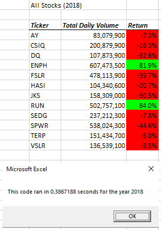
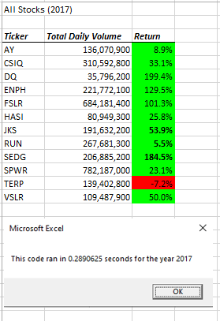

# Refactor-VBA-Code
Refactoring VBA Code for Green Stocks analysis

**Project Background**

The purpose of this stock analysis is helping client obtain and compare Total Daily Volume and Yearly Return of all stocks in particular year. 
The VBA code provides essentially infnite extensibility to Excel and using code to automate tasks decreases the chance of errors and reduces
the time needed to run analyses, especially if they need to be done repeatedly.
Refactor project will provide the solution code to loop through all the data one time in order to collect the same information that you did in other module.
Finally, we determined whether the refactoring code successfully made the VBA script run faster.

## Conclusion
In 2018, only *ENPH* and *RUN* two stocks had positive yearly Return as well as large Total Daily Volume. Both of them was outperformance than others green stocks.

In 2017, all of stocks had positive Return except *TERP* (-7.2%). "DQ" made best yearly return with 199.4% but with lowest total Daily Volume (35,796,200) in 2017.

Finally, we also confirmed that the refractor outputs for 2017 and 2018 are the same as they were in other modules: however the times for calcuating the stock analyses are much faster: 0.289 and 0.386 vs. 0.547 and 0.551 seconds for 2017 and 2018, repsectively. 

## Logic Flow

### Basic settings ###

'Get the Start and End Time

    Dim startTime As Single
    Dim endTime  As Single

    yearValue = InputBox("What year would you like to run the analysis on?")

    startTime = Timer
    
    
   'Initialize array of all tickers
    Dim tickers(12) As String
    
    tickers(0) = "AY"
    tickers(1) = "CSIQ"
    tickers(2) = "DQ"
    tickers(3) = "ENPH"
    tickers(4) = "FSLR"
    tickers(5) = "HASI"
    tickers(6) = "JKS"
    tickers(7) = "RUN"
    tickers(8) = "SEDG"
    tickers(9) = "SPWR"
    tickers(10) = "TERP"
    tickers(11) = "VSLR"
    
    'Activate data worksheet
    Worksheets(yearValue).Activate
    
    'Get the number of rows to loop over
    RowCount = Cells(Rows.Count, "A").End(xlUp).Row

#### Step 1a: ####
Create a tickerIndex variable and set it equal to zero before iterating over all the rows. 

    '1a) Create a ticker Index
    Dim tickerIndex As Integer
    tickerIndex = 0

#### Step 1b: ####
Create three output arrays: tickerVolumes, tickerStartingPrices, and tickerEndingPrices.

    '1b) Create three output arrays
    
    Dim tickerStartingPrices(12) As Single
    Dim tickerEndingPrices(12) As Single
    Dim tickerVolumes(12) As Long
        

#### Step 2a: ####
Create a for loop to initialize the tickerVolumes to zero. If the next row’s ticker doesn’t match, increase the tickerIndex.

    '2a) Create a for loop to initialize the tickerVolumes to zero.
        
    For tickerIndex = 0 To 11
        tickerVolumes(tickerIndex) = 0
        
        ' If the next row's ticker doesn't match, increase the tickerIndex.
        If tickers(tickerIndex + 1) <> tickers(tickerIndex) Then
        tickerIndex = tickerIndex + 1

        End If
     
    Next tickerIndex

#### Step 2b: ####
Create a for loop that will loop over all the rows in the spreadsheet.

        Worksheets(yearValue).Activate
        For tickerIndex = 0 To 11
            For i = 2 To RowCount

Step 3a:
Inside the for loop in Step 2b, write a script that increases the current tickerVolumes (stock ticker volume) variable and adds the ticker volume for the current stock ticker.
Use the tickerIndex variable as the index.

            If Cells(i, 1).Value = tickers(tickerIndex) Then
                tickerVolumes(tickerIndex) = tickerVolumes(tickerIndex) + Cells(i, 8).Value
                
            End If

#### Step 3b: ####
Write an if-then statement to check if the current row is the first row with the selected tickerIndex. If it is, then assign the current closing price to the tickerStartingPrices variable.

            '3b) Check if the current row is the first row with the selected tickerIndex.
            'If  Then
            If Cells(i, 1).Value <> Cells(i - 1, 1).Value Then
                tickerStartingPrices(tickerIndex) = Cells(i, 6).Value

#### Step 3c: ####
Write an if-then statement to check if the current row is the last row with the selected tickerIndex. If it is, then assign the current closing price to the tickerEndingPrices variable.

            If Cells(i + 1, 1).Value <> Cells(i, 1).Value Then
                tickerEndingPrices(tickerIndex) = Cells(i, 6).Value

#### Step 3d: ####
Write a script that increases the tickerIndex if the next row’s ticker doesn’t match the previous row’s ticker.
            '3d Increase the tickerIndex.
                tickerIndex = tickerIndex + 1
        'End If
            End If
        
        Next i
    
    Next tickerIndex
    
    
#### Step 4: ####

Use a for loop to loop through your arrays (tickers, tickerVolumes, tickerStartingPrices, and tickerEndingPrices) to output the “Ticker,” “Total Daily Volume,” and “Return” columns in your spreadsheet.

    '4) Loop through your arrays to output the Ticker, Total Daily Volume, and Return.
    Worksheets("AllStocksAnalysisRefactored").Activate
    Dim Yearcolumn As Integer
    
    For tickerIndex = 0 To 11
        If yearValue = 2017 Then
            Yearcolumn = 1
        Else
            Yearcolumn = 10
        End If

#### Step 5. #### 
Format the output sheet on All Stocks Analysis worksheet

    Worksheets("AllStocksAnalysisRefactored").Activate
    
    Cells(1, Yearcolumn).Value = "All Stocks (" + yearValue + ")"
    
    'Create a header row
    Cells(3, Yearcolumn).Value = "Ticker"
    Cells(3, Yearcolumn + 1).Value = "Total Daily Volume"
    Cells(3, Yearcolumn + 2).Value = "Return"
 
        Worksheets("AllStocksAnalysisRefactored").Activate
        Cells(4 + tickerIndex, Yearcolumn).Value = tickers(tickerIndex)
        Cells(4 + tickerIndex, Yearcolumn + 1).Value = tickerVolumes(tickerIndex)
        Cells(4 + tickerIndex, Yearcolumn + 2).Value = tickerEndingPrices(tickerIndex) / tickerStartingPrices(tickerIndex) - 1
     
    'Formatting
    Worksheets("AllStocksAnalysisRefactored").Activate
    Range(Cells(3, Yearcolumn), Cells(3, Yearcolumn + 2)).Font.FontStyle = "Bold Italic"
    Range(Cells(3, Yearcolumn), Cells(3, Yearcolumn + 2)).Borders(xlEdgeBottom).LineStyle = xlContinuous
    Range(Cells(4, Yearcolumn + 1), Cells(15, Yearcolumn + 1)).NumberFormat = "#,##0"
    Range(Cells(4, Yearcolumn + 2), Cells(15, Yearcolumn + 2)).NumberFormat = "0.0%"
    Columns(Yearcolumn + 1).EntireColumn.AutoFit
    Next tickerIndex
  
  
  
    dataRowStart = 4
    dataRowEnd = 15

    For i = dataRowStart To dataRowEnd
        
        If Cells(i, Yearcolumn + 2) > 0 Then
            
            Cells(i, Yearcolumn + 2).Interior.Color = vbGreen
            
        Else
        
            Cells(i, Yearcolumn + 2).Interior.Color = vbRed
            
        End If
        
    Next i
 
 #### Step 6. #### 
 Performance check
 
    endTime = Timer
    MsgBox "This code ran in " & (endTime - startTime) & " seconds for the year " & (yearValue)
    End Sub

